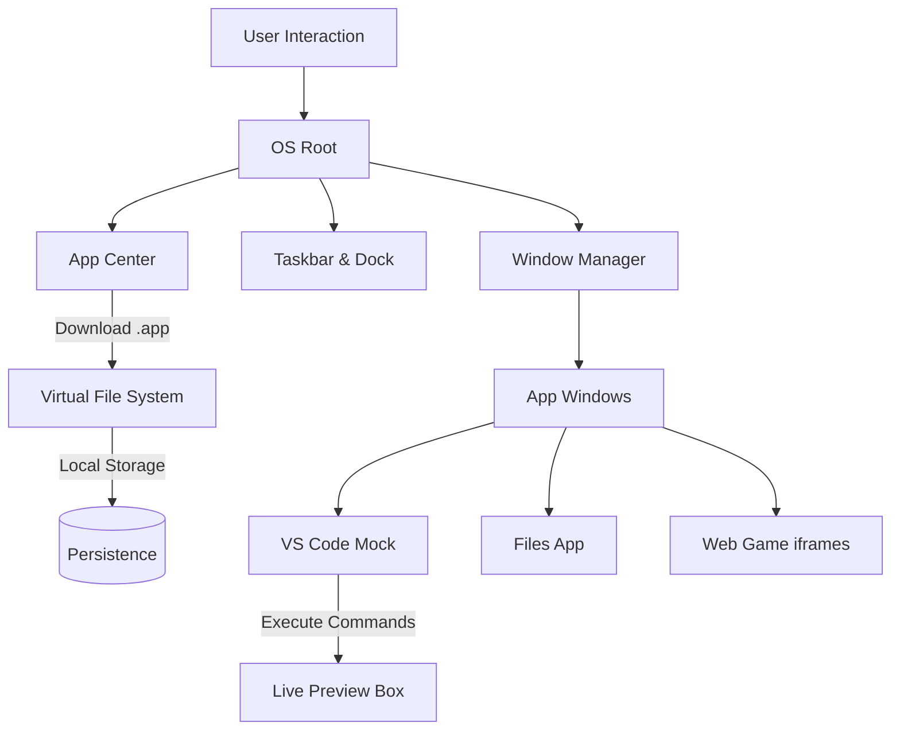

# 🚀 OS-A: The Ultimate Web-Based Operating System

[](https://os-a.netlify.app/)
[](https://opensource.org/licenses/MIT)
[](https://reactjs.org/)


**OS-A** is a premium, high-performance web-based desktop environment inspired by the best of Ubuntu and macOS. Built with React and designed for a seamless, immersive user experience, it brings the power of a desktop OS directly to your browser.

---

## ✨ Key Features

### 🛍️ Dynamic App Center
- **Categorized Apps**: Discover apps in **Work**, **Play**, and **Dev** categories.
- **Real-Time Search**: Instantly find any application with our responsive search bar.
- **Installer Workflow**: Cinematic globe animations and progress bars for a realistic "download" feel.
- **JSON Configurable**: Manage all app data (descriptions, ratings, images) via a single `appData.json` file.

### 📁 Advanced File Manager
- **macOS Finder Aesthetics**: Sleek glassmorphism, acrylic sidebars, and intuitive navigation.
- **Right-Click Context Menus**: Professional context menus with "Open With" submenus (VS Code, Terminal, etc.).
- **Virtual Persistence**: Full file system persistence using `localStorage`.
- **Project Portfolios**: Integrated `portfolio` folders that launch directly into developer environments.

### 💻 Developer Experience (DevX)
- **VS Code Mock**: A custom-built, lightweight code editor with syntax highlighting and a built-in terminal.
- **Integrated Terminal**: Run commands like `npm run dev` inside the editor to launch live previews of your projects.
- **System Monitoring**: Real-time performance dashboards to track your virtual system's health.

### 🎮 Gaming & Entertainment
- **Embedded Web Games**: Play high-quality web games like *Moto X3M*, *Endless Truck*, and *Gold Mine* natively in windowed mode.
- **Anti-Hijack Tech**: Sandboxed iframes prevent external sites from redirecting your OS tabs.
- **Tic-Tac-Toe**: A classic native game for quick entertainment.

---

## 🛠️ Architecture & Workflow



---

## 🎨 Customization
- **Theme Engine**: Switch between **Ubuntu Purple** and **OLED Black** dark modes.
- **Dock Flexibility**: Toggle between **Solid** and **Glass** dock styles.
- **Pinning System**: Easily add or remove apps from your dock using the `+` Pin Selector.

---

## 🚀 Getting Started

### Prerequisites
- Node.js (v16+)
- npm or yarn

### Installation
1. Clone the repository:
   ```bash
   git clone https://github.com/your-username/os-a.git
   ```
2. Install dependencies:
   ```bash
   npm install
   ```
3. Start the development server:
   ```bash
   npm run dev
   ```

---

## 📄 License
Distributed under the MIT License. See `LICENSE` for more information.

---

<p align="center">
  Developed with ❤️ by <a href="https://aaryandev.netlify.app/">Aaryan</a>
</p>
